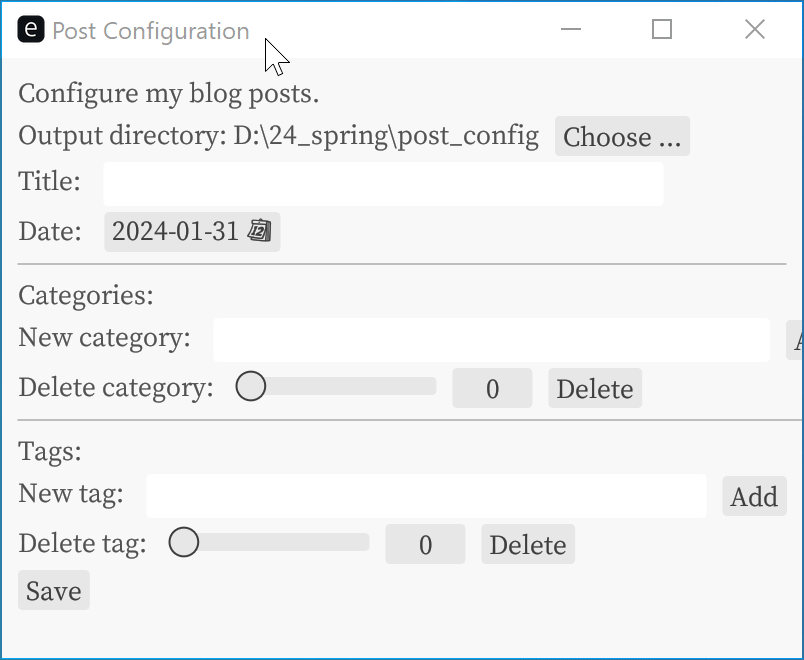

# post_config



This simple GUI tool is aimed at assisting in the creation of blog posts for my website. It generates a Markdown file named `{date}-{title}.md`.

## TODO


- [x] Chinese characters support
- [x] tags/categories

## Usage

```bash
post_config 0.1.0

USAGE:
    post_config.exe [OPTIONS]

FLAGS:
    -h, --help       Prints help information
    -V, --version    Prints version information

OPTIONS:
        --categories <categories>...    Categories of the article
        --date <date>                   Publication date of the article (optional)
        --output-dir <output-dir>        [default: .]
        --tags <tags>...                Tags associated with the article
        --title <title>                 Title of the article [default: ]
```

## Issues

- ~~Now there are some bugs in tag/category deletion.~~